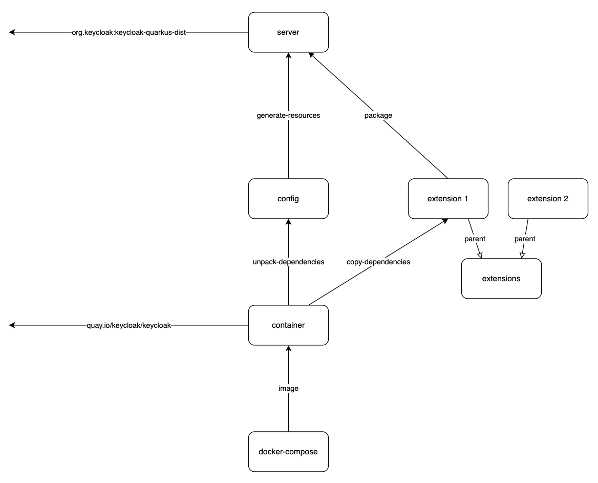

Keycloak-Custom
===============

This project creates a custom [Keycloak] server based on [Keycloak.X]. The following features are supported:

- installation via the [Keycloak distribution at Maven Central](https://mvnrepository.com/artifact/org.keycloak/keycloak-quarkus-dist)
- configuration for build and runtime stage
- setup via [Admin CLI] of Keycloak
- setup via [keycloak-config-cli] of Adorsys
- development of custom SPIs
- development of custom themes
- package as multi-arch container image based on the [Keycloak container image](https://www.keycloak.org/server/containers)
- launch from within the IDE, from script and docker-compose (soon Kubernetes)

This project is based on Maven and contains the following top-level Maven modules:

- server : provides a Keycloak installation for local testing
- config  : provides the build stage configuration and the setup of Keycloak
- container : provides the custom docker image
- docker-compose : provides a sample for launching the custom docker image
- extensions : provides samples for Keycloak SPI implementations
- themes : provides samples for custom themes



There are similar projects available on the internet:

- [Keycloak Project Example](https://github.com/thomasdarimont/keycloak-project-example)
- [Keycloak Docker Quickstart](https://github.com/OpenPj/keycloak-docker-quickstart)

Requirements
------------

In order to use this project, you need to install the following components:

- Java 11
- Docker 
- [jq](https://stedolan.github.io/jq/)

Module server
-------------

This module installs the official Keycloak distribution via a Maven dependency into the folder referenced by the property [${keycloak.dir}]. The default value is `server/target/keycloak`.

The following Maven command does the installation:

```shell
./mvnw clean initialize
```

After a successful execution the newly created Keycloak installation could be started with the factory settings by executing the `kc.sh start-dev` script from the `./server/target/keycloak/bin` directory. Because we want to apply a custom configuration to this installation, we wait with starting up Keycloak until we have introduced the `config` module.

For passing a defined set of environment variables to the above script, we will use the wrapper script [run-keycloak.sh] from this module.

Module config
-------------

This module copies its configuration files during the Maven `generate-resources` phase to the Keycloak installation within the `server` module.

### Configuration

Since the migration to a Quarkus runtime the [configuration of Keycloak] is done by two steps: build stage and runtime stage. A few properties can only be set in the build stage. If they must be changed, the `kc.sh` script must be executed with the `build` command. In development mode (see below) the `build` command is automatically executed during every start.

#### Build stage

In this project all properties of the build stage are configured in the [keycloak.conf] at `./config/src/main/resources/keycloak/conf/`.

We set 4 build stage properties:

```properties
# db is the name of the database vendor: dev-file, dev-mem, mariadb, mssql, mysql, oracle, postgres
db=postgres

# features is a comma-separated list of features to be enabled
features=declarative-user-profile

# metrics-enabled is for exposing metrics (/metrics) endpoints
metrics-enabled=true

# health-enabled is for exposing health check (/health) endpoints
health-enabled=true
```

In the `generate-resources` phase of a Maven build this [keycloak.conf] file is copied to `${keycloak.dir}` (= `./server/target/keycloak`).

Please see [Keycloak / Guides / Server / All configuration / Build options](https://www.keycloak.org/server/all-config?f=build) for the list of all available build stage properties.

#### Runtime stage

All properties of the runtime stage are set as environment variables.

##### Environment variable files

In this project we are using three `.env` files (in `./docker-compose/src/main/resources`) for maintaining the environment variables:

- [keycloak.common.env]
- [keycloak.specific.env]
- [secrets.env]

These 3 files are also used when Keycloak is started with the launch procedures described in the next section.

###### keycloak.common.env

Default values are defined here.

###### keycloak.specific.env

Environment specific properties should be set in the [keycloak.specific.env] file. This file is not under version control and should be made available in every specific environment. It is also a good place for setting local values (e.g. for debugging) of some properties. 

The following two definitions are used for accessing the `keycloak-custom` schema of a Postgres instance from Keycloak running within a container and to set the global log level to `info` and the log level for all `com.inventage` Loggers to `debug`:

```properties
# connecting Keycloak from running inside a container to a Postgres server running on the docker host (MacOS)
KC_DB_URL=jdbc:postgresql://host.docker.internal:5432/keycloak-custom

KC_LOG_LEVEL=info,com.inventage:debug
```

###### secrets.env

Sensitive properties can be stored in the `secrets.env` file. This file is not under version control and must be available when running `docker-compose up` with the provided [docker-compose.yml](./docker-compose/src/main/resources/docker-compose.yml) file.

The two properties for creating the initial admin user for the `master` realm are good candidates for this file:

```properties
# KEYCLOAK_ADMIN is the username of the initial admin user
KEYCLOAK_ADMIN=admin

# KEYCLOAK_ADMIN_PASSWORD is the password of the initial admin user
KEYCLOAK_ADMIN_PASSWORD=admin
```

##### Production mode

For starting Keycloak in production mode, a few properties must be set. Please see also the official documentation [Configuring Keycloak for production](https://www.keycloak.org/server/configuration-production).

##### HTTPS

### Launching Keycloak

Keycloak provides the `bin/kc.sh` script for launching it. Keycloak can be launched in two modes: development (`start-dev`) or production (`start`).

In this project we support the following types of launching Keycloak:

- via IntelliJ run configuration
- via script
- via docker-compose
- via Kubernetes (soon)

Because we have configured the database in the above section with `db=postgres` we need an up & running instance of Postgres before launching Keycloak. The easiest way for that is by configuring the `KC_DB_URL` property (e.g. in [keycloak.specific.env]):

```properties
KC_DB_URL=jdbc:postgresql://localhost:15432/postgres
```

and then running the provided [docker-compose.yml](docker-compose/src/test/resources/postgres/docker-compose.yml) in `docker-compose/src/test/resources/postgres/`. 

If you haven't executed a full build of this project, now is a good moment to execute `./mvnw clean install`.

#### via IntelliJ run configuration

Launching Keycloak directly from the IDE allows the greatest support for development purposes. Because Keycloak is launched as a Java process, it can be easily started in debug mode. Before running the `keycloak` run configuration, please run the `kc.sh build` run configuration before.

#### via script

For launching Keycloak from within this project we use the wrapper script [run-keycloak.sh] from the `server` module. This script is not used for launching Keycloak outside this project. The main purpose of this script is to set the necessary environment variables. The `--debug` flag is set, so that a debugger can be attached.

The [run-keycloak.sh] script takes one or more arguments. The first argument is the command be executed `start-dev` or `start`. Every further argument must be a filesystem path to a properties file. Every contained property will be set as an environment variable. Later files override earlier files.

```shell
$ ./server/src/test/resources/run-keycloak.sh start-dev <properties.env>
```

##### Development mode

To start Keycloak in development mode execute the following command in a shell from the project root directory:

```shell
$ ./server/src/test/resources/run-keycloak.sh start-dev \
  docker-compose/src/main/resources/keycloak.common.env \
  docker-compose/src/main/resources/keycloak.specific.env \
  docker-compose/src/main/resources/secrets.env
```

For an easy usage this project provides also the IntelliJ run configuration `run-keycloak.sh start-dev` for starting Keycloak in `development` mode.

##### Production mode

To start Keycloak in production mode execute the following command in a shell from the project root directory:

```shell
$ ./server/src/test/resources/run-keycloak.sh start \
  docker-compose/src/main/resources/keycloak.common.env \
  docker-compose/src/main/resources/keycloak.specific.env \
  docker-compose/src/main/resources/secrets.env
```

If you try to launch Keycloak in production mode, but you have not executed the `kc.sh build`, then you will get the following error message:

```shell
ERROR: You can not 'start' the server in development mode. Please re-build the server first, using 'kc.sh build' for the default production mode.
```

For a simple use this project provides also IntelliJ run configurations `kc.sh build` and `run-keycloak.sh start` for starting Keycloak in `production` mode.

#### via docker-compose

The custom Keycloak instance from this project can also be started easily by docker-compose. The only prerequisite is that you have build this project before with `./mvnw clean install`, so that the container image has been created.

```shell
keycloak-custom/docker-compose/target/keycloak
```

For more details pleased see below in the module `docker-compose` section.

### Setup

We will create and configure a new realm `example1`.

Module container
----------------

In the `install` phase of the Maven build a custom container image is built. The `container` module uses a [Dockerfile](./container/src/main/resources/Dockerfile) for specifying the newly created image.

Module docker-compose
---------------------

This module contains the docker-compose file for starting the custom Keycloak docker image built by the `container` module.

Module extensions
-----------------

The `extensions` module is configured, so that every contained extension module can easily deploy its artifact to the `server` module. The following snipped must be included to the pom.xml of the new extension:

```xml
    <build>
        <plugins>
            <!-- deploy extension -->
            <plugin>
                <groupId>org.apache.maven.plugins</groupId>
                <artifactId>maven-antrun-plugin</artifactId>
                <!-- config is defined in parent pom -->
            </plugin>
        </plugins>
    </build>
```

### Extension NoOperationAuthenticator

This extension is an example of a custom Keycloak Authenticator implementation.

### Extension NoOperationProtocolMapper

This extension is an example of a custom Keycloak Protocol Mapper implementation.

Module themes
-------------

The `themes` module contains the custom themes, which should be available in the custom Keycloak.

Tooling
-------

The [Apache Maven Wrapper](https://maven.apache.org/wrapper/) is used for the Maven setup for this project.


[Keycloak]: https://keycloak.org
[Keycloak.X]: https://www.keycloak.org/migration/migrating-to-quarkus
[Admin CLI]: https://www.keycloak.org/docs/latest/server_admin/index.html#admin-cli
[configuration of Keycloak]: https://www.keycloak.org/server/configuration
[keycloak-config-cli]: https://github.com/adorsys/keycloak-config-cli
[keycloak.conf]: ./config/src/main/resources/keycloak/conf/keycloak.conf
[run-keycloak.sh]: ./server/src/test/resources/run-keycloak.sh
[docker-compose.yml]: ./docker-compose/src/main/resources/docker-compose.yml
[keycloak.common.env]: ./docker-compose/src/main/resources/keycloak.common.env
[keycloak.specific.env]: ./docker-compose/src/main/resources/keycloak.specific.env
[secrets.env]: ./docker-compose/src/main/resources/secrets.env
