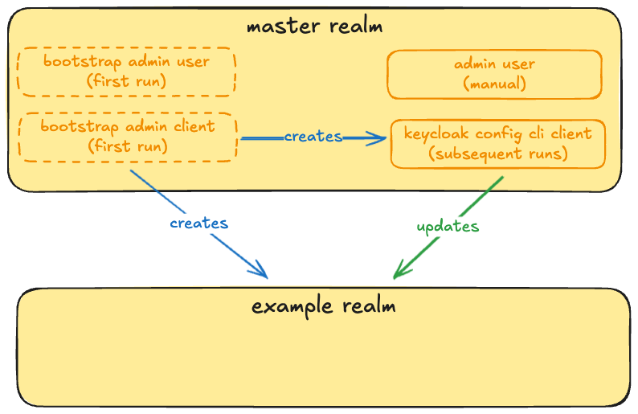

# Keycloak-Custom

## Project Template

This project is based on the [custom Keycloak template](https://github.com/inventage/keycloak-custom). It is structured
as a multi-module Maven build and contains the following top-level modules:

- `config`: provides the build stage configuration and the setup of Keycloak
- `container`: creates the custom docker image
- `docker-compose`: provides a sample for launching the custom docker image
- `extensions`: provides samples for Keycloak SPI implementations
- `helm`: provides a sample for installing the custom container image in Kubernetes using the Codecentric Helm Chart
- `server`: provides a Keycloak installation for local development & testing
- `themes`: provides samples for custom themes

Please see the
tutorial [building a custom Keycloak container image](https://keycloak.ch/keycloak-tutorials/tutorial-custom-keycloak/)
for the details of this project.

## Configuration of Keycloak

### Bootstrap Process

Since [Keycloak 26 there are temporary bootstrap admin accounts for user and client](https://www.keycloak.org/docs/latest/upgrading/#admin-bootstrapping-and-recovery),
which are created and used during the first start of Keycloak. Afterward, this user/client should be deleted.
Hence, during the first setup of Keycloak we add a permanent client with a service account. This account can then be used for future setup runs.
Our setup script uses two **configuration tools**: [keycloak-config-cli](https://github.com/adorsys/keycloak-config-cli) and [kcadm](https://github.com/keycloak/keycloak/blob/main/integration/client-cli/admin-cli/src/main/bin/kcadm.sh).

1. On the first run
    - the following environment variables need to be present:

      ```text
      KC_BOOTSTRAP_ADMIN_USERNAME
      KC_BOOTSTRAP_ADMIN_PASSWORD
      KC_BOOTSTRAP_ADMIN_CLIENT_ID
      KC_BOOTSTRAP_ADMIN_CLIENT_SECRET
      KEYCLOAK_CONFIG_CLI_CLIENT_ID
      KEYCLOAK_CONFIG_CLI_CLIENT_SECRET
      ```

    - The first 4 env vars are used to create a temporary user and client with admin privileges.
    - The temporary admin client is used to create the `master` realm.
    - With the creation of the `master` realm, a permanent service-account and a permanent client are created based on the last 2 env vars.

2. On subsequent runs
   - Temporary users and clients should not be used anymore!
   - Which client is used for applying the configuration is determined by the `KEYCLOAK_CLIENTID` and `KEYCLOAK_CLIENTSECRET` env vars.
   - Initially, these env vars point to the temporary admin client.
   - As we now have an alternative permanent client available, it should be used instead.
   - **[helm]** After the first startup, you should switch to the permanent `keycloak-config-cli` client. See the comments in the `helm/src/test/resources/local/keycloak-custom-*.yaml` files for instructions on what to change.

   - **[docker]** Replace in [keycloak.common.env](docker-compose/src/main/resources/keycloak.common.env):

      ```properties
      KEYCLOAK_CLIENTID=${KC_BOOTSTRAP_ADMIN_CLIENT_ID}
      KEYCLOAK_CLIENTSECRET=${KC_BOOTSTRAP_ADMIN_CLIENT_SECRET}
      ```

      with:

      ```properties
      KEYCLOAK_CLIENTID=${KEYCLOAK_CONFIG_CLI_CLIENT_ID}
      KEYCLOAK_CLIENTSECRET=${KEYCLOAK_CONFIG_CLI_CLIENT_SECRET}
      ```



The following table shows which admin accounts are created after the first start of Keycloak and the first execution of the setup script:

| Configuration Account       | Temporary           | Permanent                                  |
| --------------------------- | ------------------- | ------------------------------------------ |
| Service Account `client-id` | `temp-client-admin` | `keycloak-config-cli`                      |
| Admin User `username`       | `temp-admin`        | (not configured, must be created manually) |

Below you can find a table with all the environment variables which are used during setup and which can be changed individually.
The setup script creates in the first run a permanent service account specifically created for the configuration tools.
The service account can be configured with the properties `KEYCLOAK_CONFIG_CLI_CLIENT_*`.
The configuration tools use for authentication as default the bootstrap admin client (`KC_BOOTSTRAP_ADMIN_CLIENT_*`) which is configured in
`KEYCLOAK_CLIENT_*`.
It is possible to let the configuration tools use the service account after the first setup run.
You can achieve this by setting `KEYCLOAK_CLIENTID` to `${KEYCLOAK_CONFIG_CLI_CLIENT_ID}` and `KEYCLOAK_CLIENTSECRET` to `${KEYCLOAK_CONFIG_CLI_CLIENT_SECRET}`.

| Environment Variable Name | Description                                                                           | Default Value                         |
| ------------------------- | ------------------------------------------------------------------------------------- | ------------------------------------- |
| `KC_BOOTSTRAP_ADMIN_USERNAME` | Bootstrap admin username                                                              | `temp-admin`                          |
| `KC_BOOTSTRAP_ADMIN_PASSWORD` | Bootstrap admin password                                                              | `admin` (**Please change!**)          |
| `KC_BOOTSTRAP_ADMIN_CLIENT_ID` | Bootstrap Admin Client Id                                                             | `temp-client-admin`                   |
| `KC_BOOTSTRAP_ADMIN_CLIENT_SECRET` | Bootstrap Admin Client Secret                                                         | `admin` (**Please change!**)          |
| `KEYCLOAK_CONFIG_CLI_CLIENT_ID` | Used for creating the regular client for keycloak-config-cli in `realm-master.json`   | `keycloak-config-cli`                 |
| `KEYCLOAK_CONFIG_CLI_CLIENT_SECRET` | Used for creating the regular client for keycloak-config-cli in `realm-master.json`   | `keycloak-config-cli`                 |
| `KEYCLOAK_GRANT_TYPE`     | Property used by keycloak-config-cli, it is either `password` or `client_credentials` | `client_credentials`                  |
| `KEYCLOAK_CLIENTID`       | Property used by keycloak-config-cli and kcadm                                        | `${KC_BOOTSTRAP_ADMIN_CLIENT_ID}`     |
| `KEYCLOAK_CLIENTSECRET`   | Property used by keycloak-config-cli and kcadm                                        | `${KC_BOOTSTRAP_ADMIN_CLIENT_SECRET}` |

### realm-example.json

In order to update the realm-example.json, it is recommended to follow these steps:

- On the admin UI, create a new realm
- Export the `realm-export.json` (default config)
- Configure a single entity i.e. `client`, `clientScope`, `role`, `identityProvider` etc.
- Export the `realm-export.json` (custom config)
- Compare the changes between the export (diff)
  - In order to compare the JSON files more effectively:
  - Remove any `id`' keys (those are Keycloak internal ids)
  - Sort all objects and arrays recursively
  - All of the above can be applied with the following `jq` script:

    ```bash
    jq --sort-keys '
        walk(
            if type == "object" then
                del(.id, .containerId)
            else
                .
            end
        ) |
        walk(
            if type == "array" then
                if (.[] | select(type == "object")) then
                    sort_by(try .name catch "", try .alias catch "", try .flowAlias catch "")
                else
                    sort
                end
            else
                .
            end
        )' realm-example.json
    ```

  - Start a new `realm-example.json`, including only the custom config that deviates from the default config (the diff from the previous step)
  - Replace any environment specific configuration i.e. URL, client-ids and client-secrets with env vars
  - Apply the configuration with the `keycloak-config-cli`
